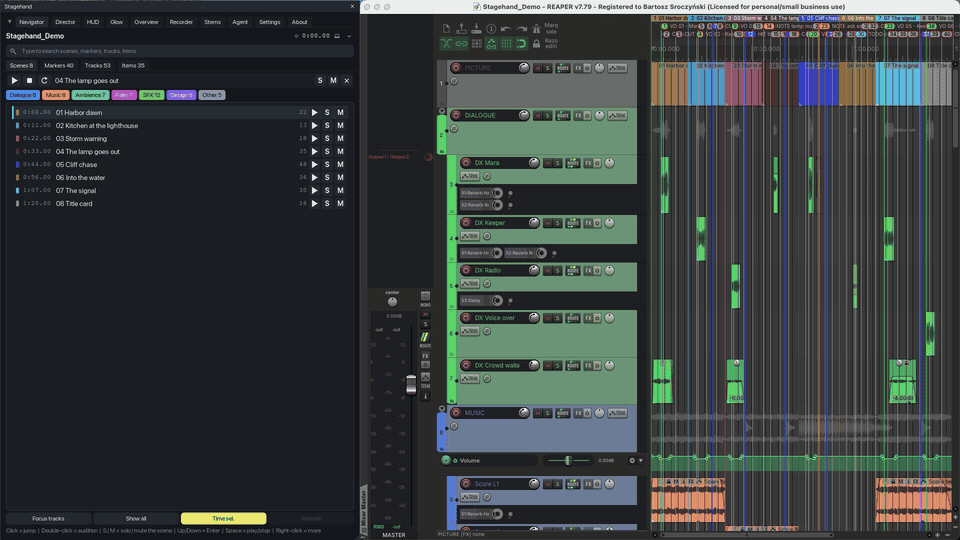
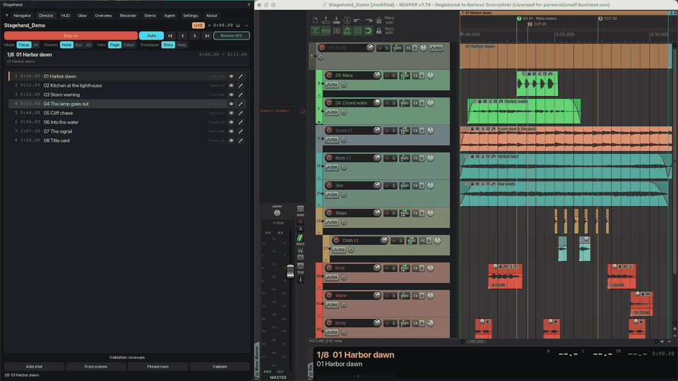
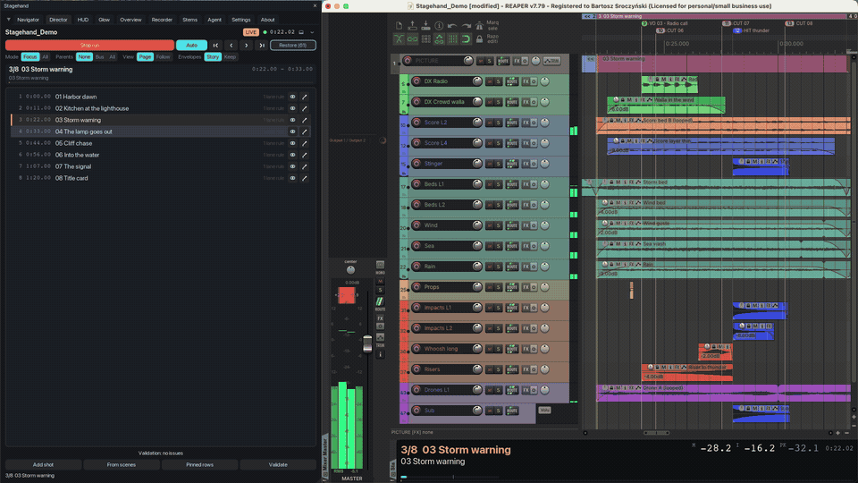

# Stagehand for REAPER

Session navigator, showcase director, stems and session overview for REAPER 7 - one ReaScript package (Lua + ReaImGui,
Windows / macOS / Linux), configurable end to end. A falami.studio tool by Bartosz Sroczynski, MIT licence.

- **Navigate**: scenes (regions), markers, tracks and items in a dockable window; fuzzy search, jump with the right zoom,
  audition in place with auto-stop, solo or mute a scene and restore exactly what changed. A solo you set yourself
  survives.
- **Direct**: a shot list (from the scenes, with a validator) and follow-play - the arrange shows the lanes of the
  current shot at locked heights, pinned rows, parents, automation lanes when the story needs them, page or follow view.
- **Show**: the HUD caption bar (shot name, caption, progress, time, loudness live or from a curve) and the Glow overlay
  that lights the arrange with the sound (meters or items, sparks from the take peaks, profiles per family).
- **Record**: sync flashes and companion drivers (macOS, Windows, Linux, an OBS recipe) capture a clean showcase video
  with the mix laid under the picture.
- **Overview**: one tall image of the whole session with every used automation lane open.
- **Deliver stems**: stem sets in bulk from families / folders / selection / scenes, a matrix editor, render settings
  owned by Stagehand, a sequential renderer whose pre-flight defuses every dialog that would stall a batch, a results
  page with peak and loudness.
- **Configure**: every knob in one Settings tab drawn from a schema, presets, per-project overrides, invalid values
  reported and never silently repaired.
- **Ask an agent**: an AI agent (Claude and the like) reads the session and drives Stagehand through the bundled MCP
  server: it can build and edit the shot list, run the Director, change any setting and render stems, gated by three
  switches you own.

## Install

1. In REAPER: **Extensions > ReaPack > Import repositories...** and paste
   `https://raw.githubusercontent.com/b451c/Stagehand/main/index.xml`
2. **Extensions > ReaPack > Browse packages**, search "Stagehand", right-click > Install (ReaImGui is installed as a
   dependency when missing).
3. Run **Stagehand** from the action list (or one of the module actions: Navigator, Director, HUD, Glow toggle, Overview,
   Recorder, Stems, Agent, Settings) and give it a shortcut.

Requires REAPER 7.x and ReaImGui. js_ReaScriptAPI (optional) unlocks the glow overlay, the screen layout and the overview
geometry; SWS (optional) opens links from the About tab. The companions in `tools/` need Python 3 (Pillow and ffmpeg
optional). Manual install: copy the `Stagehand` folder into `<REAPER resource path>/Scripts/` and load `Stagehand.lua`
through Actions > Show action list > New action > Load ReaScript.

## Documentation

- [User guide](https://b451c.github.io/Stagehand/guide.html) (also `docs/user-guide.md`) - every tab, the keys, the
  companions, the agent access.
- [Configuration reference](docs/config-reference.md) - every setting with its range and default, generated from the schema.
- [Companions and checkers](tools/README.md) - the recorder, overview, stems and agent tools.
- [Demo video](https://github.com/b451c/Stagehand/releases/latest/download/Stagehand_demo_1080p.mp4) (4 min, 1080p;
  a [720p copy](https://github.com/b451c/Stagehand/releases/latest/download/Stagehand_demo_720p.mp4) is on the
  [release page](https://github.com/b451c/Stagehand/releases/latest)). The picture is a scripted tour of the demo session;
  the narration is a synthetic voice reading the demo script.

## Trust rules

Everything Stagehand changes in a project is journaled and put back: on Restore, when the window closes, after a
script error and at REAPER's exit. Nothing is saved without you. Solo, mute, selection, layout, view, render settings -
the restore diff of every test scenario is zero on three platforms.

## Support

Stagehand is free and open source. If it earns its place in your sessions, please consider supporting its
development - it makes a real difference and helps keep the project alive:

- [Ko-fi](https://ko-fi.com/quickmd)
- [Buy Me a Coffee](https://buymeacoffee.com/bsroczynskh)
- [PayPal](https://paypal.me/b451c)

The About tab of the app has the same three buttons (they open the browser through SWS, or copy the link without it).
Issues and ideas: [GitHub Issues](https://github.com/b451c/Stagehand/issues).

## Development

`CHANGELOG.md` lists the releases; `reapack/README.md` describes the index generator and the release procedure;
`tools/README.md` the companions and the checkers (`check_lua_order.py`, `check_i18n.py`, the generators of the
configuration reference and the Pages guide). Every module was verified with scripted self-test scenarios on
isolated REAPER instances on Linux, Windows and macOS before the release; that harness stays outside this repository.

## License

Stagehand is a falami.studio product by Bartosz Sroczynski. Licence: MIT (see `LICENSE`).
