# Stagehand user guide

Stagehand is one ReaScript package for REAPER 7: a session navigator, a showcase director with glow and captions,
recorder companions and a one-image session overview. This guide grows with the milestones; today it covers the
**Navigator**, the **Director** (shot list and follow-play), the **HUD** (the caption bar for the recording), the
**Glow** (the overlay that lights the arrange with the sound), the **Overview** (one tall picture of the whole
session), the **Recorder** (the control protocol for the companion scripts, the checklist, the screen layout at
start, the shot-list export), the **Stems** (stem definitions in bulk, a matrix editor, Stagehand-owned render
settings, a sequential renderer with a pre-flight and a results page), the **Agent** tab (an AI agent reads the
session and drives Stagehand through the bundled MCP server, at your discretion) and **Settings** (every knob,
presets, per-project overrides). Requirements: REAPER 7.x
and ReaImGui (install it through ReaPack: Extensions > ReaPack > Browse packages > "ReaImGui: ReaScript binding for
Dear ImGui"). js_ReaScriptAPI is optional: it unlocks the Glow overlay, the screen layout, the overview geometry and
scrolling. The companion scripts in `tools/` need Python 3 (Pillow and ffmpeg widen what they can do).

## Install and start

1. Install the package through ReaPack (repository index: see the README) or copy the `Stagehand` folder into
   `<REAPER resource path>/Scripts/` and load `Stagehand.lua` through Actions > Show action list > New action >
   Load ReaScript.
2. Run **Stagehand** (the main window), **Stagehand - Navigator**, **Stagehand - Director**, **Stagehand - HUD**,
   **Stagehand - Overview**, **Stagehand - Recorder**, **Stagehand - Agent** or **Stagehand - Settings** (they open the app on that tab; when
   the app already runs they only switch the tab; the HUD launcher also shows the caption bar). **Stagehand - Glow toggle** switches the overlay on and off in the running app - give it a
   shortcut for the recording session. Give the main action a shortcut too, for example Ctrl+Alt+N.
3. The window is dockable: click the dock icon in the header, press Ctrl+D, or drag the window into a REAPER docker.
   Dock, size, active tab and the toggles are remembered per project (with a global fallback for new projects).

Running the main action again while Stagehand is open closes the running instance and starts a fresh one.

## Navigator

The Navigator answers "take me there" and "let me hear only this" in a large session.

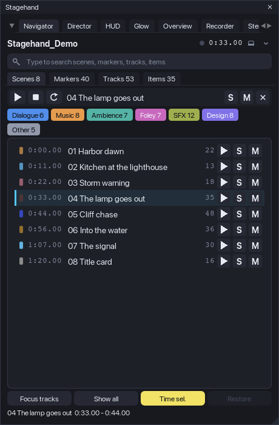{narrow}

### The window, top to bottom

- **Header**: project name, transport time with a play indicator, the dock/undock button and the menu (chevron).
- **Groups** (only when you defined some): buttons for named time ranges with digit keys, see *Groups*.
- **Search**: type to filter the current list. Fuzzy by default: every word of the query must appear in the name, as
  a substring or as an in-order subsequence (`hbr` finds "Harbor"). Enter jumps to the highlighted row (the first
  match when nothing is highlighted). Esc clears. Ctrl+F puts the cursor into the field from anywhere.
- **Tabs**: Scenes, Markers, Tracks, Items, each with a count. Tab / Shift+Tab cycle them when you are not typing.
- **Transport strip**: play / stop / loop for the *active scene* (the last scene you clicked, else the scene under
  the cursor), its name, and the scene **S** / **M** buttons plus **x** (clear every solo and mute Stagehand set).
- **Family chips**: switch families on and off. They filter what scene solo / mute act on and what the Items tab
  lists. Hidden in the compact layout (window lower than 430 px); the filter still applies.
- **The list** of the active tab. Click = jump, double-click = audition, right-click = context menu. The row under
  the cursor (scene containing it, marker within 0.25 s, selected track, item containing it) carries an accent bar.
- **Footer**: *Focus tracks*, *Show all*, *Time sel.*, *Restore (n)*, and a status line with the last action or the
  key hints.

### Scenes

Scenes are the project's regions, sorted by time, with their colour, start time and the number of items that overlap
them. Per row: **play** (audition the scene: play from its start, stop at its end), **S** (solo the scene), **M**
(mute the scene). A click jumps: edit cursor to the start, arrange zoomed to the scene (padding 0.3 s or 6 % of the
length), time selection set to the scene when *Time sel.* is on, and, when *Focus tracks* is on, only the tracks
with items in the scene stay visible in the track panel (their folders stay open; everything else is hidden).

**Solo scene** soloes *in place* (`I_SOLO = 2`) every track that has at least one item overlapping the scene and
passes the family filter. Sends, returns and folder parents are heard through REAPER's own solo-in-place logic.
A track you had soloed yourself before is never touched, and survives when the scene solo is cleared. Press **S**
again (or **x**, or Ctrl+0) to put back exactly the solos Stagehand set. Soloing another scene clears the previous
one first.

**Mute scene** mutes the *items* inside the scene, not the tracks: the tracks keep playing outside the scene. An
item you had muted before stays muted when the scene mute is cleared. Both operations are one undo point each
("Stagehand: Solo scene ...").

### Markers

Every marker with its time and a colour class (see *Marker classes*). Click = cursor on the marker and a 5 s window
around it (2.5 s each side). **play** auditions from the marker to the next marker (the last marker plays 5 s).

### Tracks

The whole track tree with folder depth, a family colour dot (folders show a folder icon in the family colour), item
counts and live **S** / **M** buttons (solo in place / mute of that track, plain REAPER toggles in an undo point).
Click = select the track, show it if it was hidden, and scroll it into view. Right-click > *Audition* plays the
active scene with that track soloed in place.

### Items

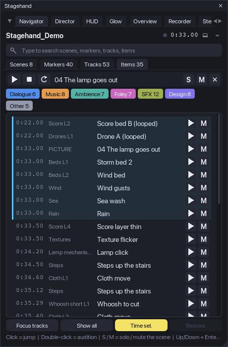{narrow}

The items of the active scene, sorted by time, with the track name. **play** auditions the item with its track
soloed in place and stops at the item end; **M** mutes / unmutes the item. Click = cursor at the item, zoom to it,
the item and its track selected and scrolled into view. When no scene is active, the tab says so: click a scene or
put the cursor inside one.

### Audition

An audition plays a range through REAPER's transport and stops by itself at the end of the range (within one defer
frame, about 30 ms). While it plays, the row's play button is lit. Any temporary solo it set (the item's or track's
solo in place) is put back when it ends or when you press stop / Space. With **Loop** on (transport strip, Ctrl+L,
or the menu) the range becomes the loop range with repeat on for the duration of the audition; the previous repeat
state and loop range come back afterwards.

### Focus tracks and Show all

*Focus tracks* (Ctrl+H) hides, on every scene jump, the tracks without items in that scene (`B_SHOWINTCP`), keeping
their folders open. Turning it off restores the hidden tracks. *Show all* (Ctrl+A) makes every track visible in the
track panel. Both only change track-panel visibility; mixer, mute and solo are untouched. Both are journaled, so
*Restore* puts the visibility back exactly as it was before Stagehand touched it.

### Restore: nothing is left behind

Everything the Navigator changes in the project is recorded in a journal before the change is made: solos, item
mutes, hidden tracks, the repeat state and the loop range of an audition. *Restore (n)* in the footer (and the menu
entry) replays the journal in reverse. A value you changed yourself after Stagehand set it is left alone and reported
as "left as you changed them". Closing the window, a script error and REAPER's exit all run the same restore. The
journal is saved with the project state, so if REAPER quits mid-way the next launch offers to restore what was left
("Restore from the last run?" with Restore / Discard).

Things that are *not* restored because they are what you asked for: the edit cursor, the arrange zoom, the time
selection of a jump (switch *Time sel.* off if you want to keep yours; REAPER links the loop points to the time
selection by default), track and item selection, and the per-track **S** / **M** toggles in the Tracks and Items
tabs (those are plain REAPER toggles, undo them with Ctrl+Z).

Stagehand never saves the project. Per-project state (tab, toggles, families, groups saved for the project) lives in
the project's extension state and is written to disk only when *you* save.

### Groups

Groups are named time ranges with a digit key, for example acts of a picture or sections of a song. Menu >
*Groups...*: add a row, name it, pick a key (1-9, 0), type the range or take it from the time selection or the
active scene. Save globally or for this project. Group buttons appear under the header; the group containing the
cursor is highlighted; the digit keys jump when you are not typing in the search field.

### Families

Menu > *Families...*. A family has a name, a colour, a rule and a "match on" scope: the top folder's name (default),
the track's own name, or the track and any of its parents. Rules are tokens separated by `|`: `TOKEN` = the name
contains it, `^TOKEN` = starts with it, `=TOKEN` = equals it; case does not matter. Tracks that match no rule form the
family *Other*. The shipped set: Dialogue (`^DIALOG|^DIA|^DX|^VO|^VOICE`), Music (`^MUSIC|^MX|^MUS|^SCORE`),
Ambience (`^AMB|^ATMO|^BG`), Foley (`^FOL`), SFX (`^SFX|^FX|^EFFECT`), Design (`^DESIGN|^DSG|^DSN`).
Saving globally also removes a project override of the same list, so what you see is what you saved.

### Marker classes

Menu > *Marker classes...*: the same rule syntax on marker names, evaluated top to bottom, first match wins.
The class gives the marker its dot colour in the list. Shipped: Cut (`^CUT|^SHOT`), Dialogue (`^VO|^DX|^DIAL|^LINE`),
Hit (`HIT|IMPACT|STING|FLASH|BOOM`), Todo (`^TODO|^FIX|^CHECK`), Note (`^NOTE`).

### Keys (window focused)

| Key | Action |
|---|---|
| Up / Down, Enter | move the highlight, jump to it |
| Ctrl+Enter | audition the highlighted row |
| Space | play / stop (also ends an audition) |
| Tab / Shift+Tab | next / previous tab |
| 1-9, 0 | jump to the group with that key |
| Esc | clear the search |
| Ctrl+F | search field |
| Ctrl+H | Focus tracks on / off |
| Ctrl+A | Show all tracks |
| Ctrl+T | Time selection on jump on / off |
| Ctrl+L | Loop auditions on / off |
| Ctrl+D | dock / undock |
| Ctrl+R | refresh the lists (they also refresh on every project change) |
| Ctrl+0 | clear every solo and mute Stagehand set |

On macOS use Cmd where the table says Ctrl. While the search field is active, letters, digits and Space type into
it; the other keys work as listed. While the Stagehand window has keyboard focus REAPER's own shortcuts do not fire.


## Director

The Director answers "show the story of the session while it plays". You describe the session as a list of
**shots**: time ranges with the tracks (lanes) that tell the story of that fragment and a caption for the viewer.
During a **run** the arrange follows playback: a little before each shot starts, the track panel switches to that
shot's lanes, their heights are locked so the lanes fill the arrange, the folder rows and envelope lanes you asked
for stay visible, and the view zooms to the shot with a short animation. When the run stops, everything is put back
exactly as it was. The HUD shows the shot's caption while it plays and the Glow lights the items that sound (their
own chapters below); the recorder companions arrive with milestone M5.

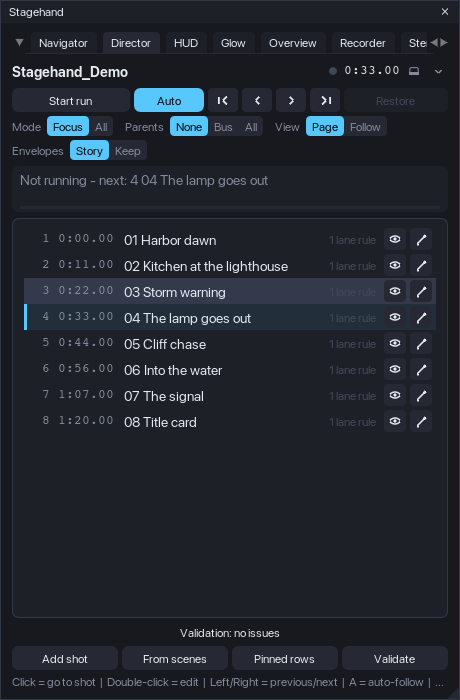{narrow}

### The window, top to bottom

- **Header**: project name, a **LIVE** badge while a run is active (Stagehand controls the track layout), transport
  time, dock and menu.
- **Controls**: *Start run* / *Stop run*, *Auto* (auto-follow on/off), first / previous / next / last shot, and
  *Restore (n)* with the number of journaled layout changes.
- **Settings** (hidden in the compact layout): *Mode* Focus / All, *Parents* None / Bus / All, *View* Page / Follow,
  *Envelopes* Story / Keep. Changing one re-applies the current shot at once, so you see the effect while it plays.
- **Current shot**: number, name, time range, a progress bar of the shot and the caption's first line. When no run is
  active it shows which shot would start at the cursor.
- **The shot list**: number, start time, name, a summary of its rules and a validation badge (red = error, yellow =
  warning, blue = note; hover or right-click for the text). Click = go to the shot (cursor to its start, run started
  if needed), double-click = edit. Per row: **eye** = preview the layout without moving the cursor (auto-follow
  pauses), **pencil** = edit. Right-click: go to, preview, edit, duplicate after, remove.
- **Validation** line under the list: click to open the report; click an entry to highlight its shot.
- **Footer**: *Add shot*, *From scenes*, *Pinned rows*, *Validate*, and the status line.

### Building the shot list

- **From scenes** appends one shot per region: the region's name and caption, the range of the region, and one lane
  rule *Items in range* (every track with an item inside the range). It is the fastest way to a first showcase of a
  session that already has regions; then edit the shots that need fewer or other lanes.
- **Add shot** opens the editor with the time selection (or ten seconds from the cursor) as the range.
- The **shot editor**: name; start and end (typed, from the cursor, from the time selection, or from the scene under
  the cursor); caption and an optional second caption (another language; the character counters turn yellow above
  the HUD limit); the **lanes**; the **envelope lanes**; per-shot overrides of the view and the parents setting.
  Lanes are rules, evaluated when the shot is applied, so a renamed or added track is picked up without editing:
  - *Items in range* - every track with an item overlapping the shot, optionally limited to one family;
  - *Family* - every non-folder track of a family (the families of the Navigator);
  - *Name rule* - the rule syntax of the families (`TOKEN` contains, `^TOKEN` starts with, `=TOKEN` equals, several
    with `|`), for example `=DX Mara|=DX Keeper` or `^Score`;
  - *One track* - picked from the tree (remembered by GUID, then by name).
  The *Tracks* column shows how many tracks each rule resolves to right now. Envelope rules pair a track rule with an
  envelope-name rule (`Volume`, `Pan`, `Mute`, a send or an FX parameter name) and show their match count.
- **Pinned rows** (footer or menu) are rows that stay at the top in every shot with a fixed height: typically the
  picture track (say 76 px) or the dialogue bus (40 px). They use the same rule syntax and are saved for the
  project or globally.
- Shots are kept sorted by start time and saved with the project (project extension state); nothing touches disk
  until you save the project.

### Validation

*Validate* (also Ctrl+R, and automatically after edits) checks the list the way the offline checker of the source
project did, and reports per shot:

- errors: an empty range, a lane rule that matches no track, no lane resolving at all;
- warnings: gaps or overlaps between shots, a missing name, a caption longer than the HUD limit (135 characters by
  default), lanes without items in the shot, envelope rules that match nothing, a lead longer than the page padding,
  and *lanes that do not fit*: the height budget at the current arrange height (pinned rows + parent rows + visible
  envelope lanes + lanes at the minimum lane height) exceeds what is available;
- notes: tracks that play in the shot but are not shown.

### The run

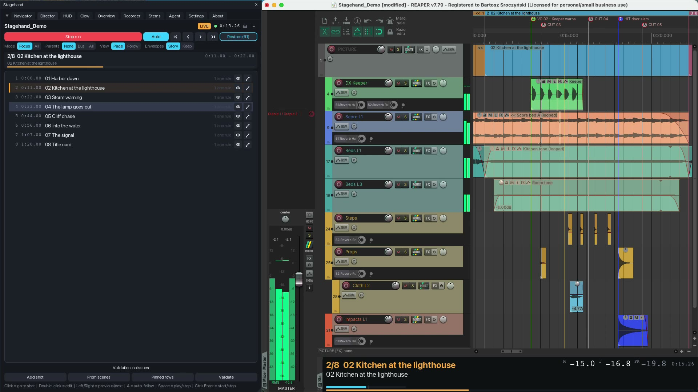{mid}

*Start run* (Ctrl+Enter) applies the shot under the cursor and switches on auto-follow. While the transport runs
the shot changes **lead** seconds (0.4 s by default) before each shot's start, so the lanes are in place when the
shot begins; a switch lands within one defer frame (about 33 ms) of that time. With auto-follow off (*Auto* or the
A key) the shot you chose stays until you pick another one. First / previous / next / last and a click on a row
move the edit cursor (seeking during playback) and apply the shot. *Stop run* (Ctrl+Enter, Esc) or *Restore* puts
the layout back. Note that with auto-follow on the layout follows the edit cursor even while the transport is
stopped: a click in the ruler's timeline lane, or the cursor jumping back when playback stops, switches the shot
and animates the view. When you are editing regions or items while a run is active, switch *Auto* off (A) or stop
the run, and the arrange stays where you left it.

What a shot does to the track panel, in order: pinned rows get their fixed height; the lanes get one common height
computed from the arrange height minus the pinned rows, the parent rows and the visible envelope lanes, clamped
between the minimum and the maximum lane height; every other track is hidden (Focus mode) or set to the compact
height (All mode); folder ancestors of the lanes are un-collapsed and, in Parents Bus / All mode, shown as thin
rows. Heights are *locked* (REAPER scales unlocked overrides with the vertical zoom). REAPER lays the list out a
frame later, so a **verify pass** measures where the last row really ends and corrects the lane height once or twice
(envelope lanes and theme minimums are only known then). The arrange scrolls to the top; in All mode it scrolls the
first lane under the pinned rows.

**View**: *Page* zooms so the shot fits the arrange with padding before and after (0.6 s / 0.5 s), and the cursor
sweeps across a still page. *Follow* keeps a window sliding with the cursor, the cursor at a third of the width; the
window is the longer of the follow length (6 s) and 60 % of the shot. The zoom animates over 0.3 s with a
smoothstep curve (linear and ease-out are available). REAPER's *continuous scrolling* is switched off for the run so
the view never pages on its own, and switched back afterwards.

**Envelopes**: in *Story* mode every track envelope lane is hidden and only the lanes a shot names are shown (the
volume automation of the music bus under the dialogue, a filter sweep on the riser); in *Keep* mode the lanes stay
as saved. Hidden lanes stay active; only their visibility changes.

**Ruler lanes** (setting `director.ruler.mode = hide`, off by default): the marker and region lanes of the ruler are
toggled off for the run and back afterwards. REAPER offers no way to read their state, so the toggle assumes they
are visible, and the ruler keeps its own minimum height: on the test machines hiding the first lane gave the arrange
10 px, the second lane nothing, and after the lanes came back the ruler stayed 10 px shorter until its edge is
dragged. Use it when the marker band really is in the way of a recording.

### Restore: nothing is left behind

Before the Director changes anything it records the previous value in the same journal the Navigator uses: per track
its visibility, height override, height lock, folder collapse and pin state; per envelope its visibility; the
arrange view and the vertical scroll position; the continuous-scrolling toggle; each ruler lane it toggled. *Stop
run*, *Restore*, closing the window, a script error and REAPER's exit replay the journal. Track and envelope entries
are restored unconditionally (the layout belongs to the Director while a run is active). If REAPER quits during a
run, the journal is offered on the next launch of that project ("Restore from the last run?").

While a run is active the Navigator's *Focus tracks* and *Show all* are disabled (two tools must not fight over
track visibility), and its *Restore* leaves the Director's entries alone. Do not save the project while a run is
active unless you want that layout in the file: stop the run, then save.

### Keys (window focused, Director tab)

| Key | Action |
|---|---|
| Ctrl+Enter | start / stop the run |
| Esc | stop the run |
| A | auto-follow on / off |
| Left / Right | previous / next shot |
| Home / End | first / last shot |
| Up / Down, Enter | move the highlight, go to the highlighted shot |
| E | edit the highlighted shot |
| Space | play / stop |
| Ctrl+R | validate |
| Ctrl+D | dock / undock |


## HUD

The HUD is the caption bar of the recording: a dockable window that shows the current shot, its caption for the
viewer, a progress bar, the transport time and a loudness readout, and that paints the sync flashes a recorder needs.
It listens to the Director: when a run starts the bar opens by itself (Auto-show) and follows the shots; when the run
stops it closes again. It changes nothing in the project.

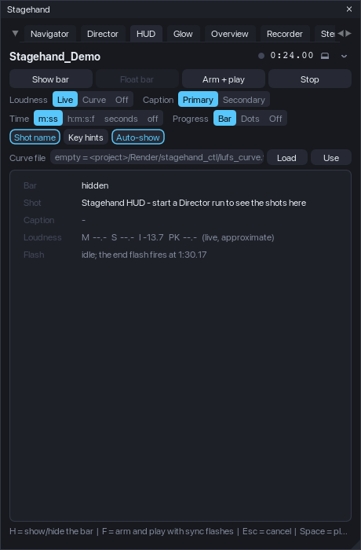{narrow}

### The bar

By default the bar opens in REAPER's bottom docker (the first docker whose position is "bottom"; drag the docker
edge to make the bar taller) and remembers its dock and size per project. When that docker also holds the mixer,
REAPER may leave the mixer switched off once the bar closes; the bar remembers the mixer's state when it opens and
puts it back a few frames after it hides. Its content depends on the height:

- **compact** (under 72 px, one row): shot number and name, the caption, the loudness digits and the time;
- **medium** (72-96 px): the shot name row with the loudness block and the time on the right, the caption below;
- **tall** (96 px and more): the caption on its own full-width row, up to two lines, the momentary loudness bar and,
  above 130 px with *Key hints* on, the rehearsal hints.

The caption tries the font sizes in order (19, 17, 15 px; 15 to 12 px in the compact row) until it fits, wraps to a
second line only in the tall tier, and ends with "..." only as the last resort (the cut never splits a character).
Fonts are logical pixels: at 24 px for the shot name and 19 px for the caption the text stays readable after a
recording is scaled to 1920 px wide. The palette is an on-camera one (dark neutral, amber shot name, cyan accents)
and does not follow the app theme; every colour is a setting (`hud.colors.*`).

The **loudness block** is fixed-width monospace so nothing jumps: `M` (momentary), `I` (integrated, highlighted in
amber inside the target window, -14 LUFS +/- 0.5 by default) and `PK` (sample peak, yellow above -1 dBFS). Sources:

- *Live*: REAPER's own master meter (`Track_GetPeakInfo` 1024 / 1025) with a gated integration in Stagehand
  (100 ms blocks, absolute gate -70, relative gate -10 LU, restarted when the position jumps back). It measures the
  master output and over-reads dense material by about half an LU when polled at 30 Hz; use it for the picture,
  not for a delivery figure.
- *Curve*: a text file with `t M S I` rows (one per 100 ms; the recorder companion writes it from the delivered mix
  with `ffmpeg -af ebur128`), indexed by the play position - exact by construction. Default path:
  `<project folder>/Render/stagehand_ctl/lufs_curve.txt`; type another path in the HUD tab and press *Use*.
- *Off*: no block.

**Progress**: a thin bar that fills with the shot, one dot per shot (the current one amber), or nothing. **Time**:
minutes:seconds, the project timecode (h:m:s:f) or plain seconds, or off. **Shot name** and **Key hints** are
toggles; keep the hints off for the recording.

### Sync flashes

*Arm + play* (F) starts the recorder's sync sequence: the whole bar paints white for 3 frames, stays dark for 6
frames, then the transport starts; when the play position passes the end (the last shot's end plus 0.17 s, or the
project end, or a custom time) the bar paints white for 3 frames again and the transport stops. Every phase edge is
logged with the wall time and the play position (`PLAY_REQUEST`, `FLASH_START`, `PLAY_CMD`, `PLAY_POS`,
`PLAY_MOVING`, `FLASH_END`, `END`) so the recorder post (M5) can anchor the mix to the picture; on the test machines the
engine reported "moving" 40-75 ms after the play command. *Stop* or Esc cancels the sequence and stops the transport.

### The HUD tab

*Show bar* / *Hide bar* (H), *Dock bar* / *Float bar*, *Arm + play*, *Stop*; the settings described above as
segmented controls; the curve file with *Load* and *Use*; and a readout of what the bar shows right now (size and
tier, shot and caption, the four loudness values with their source, the flash phase and the end time).

### Keys (window focused, HUD tab)

| Key | Action |
|---|---|
| H | show / hide the bar |
| F | arm and play with sync flashes (again: cancel) |
| Esc | cancel the flash sequence |
| Space | play / stop |
| Ctrl+D | dock / undock the main window |

## Glow

The Glow lights the arrange with the sound: a bitmap composited over the arrange view (js_ReaScriptAPI, install it
through ReaPack) that is redrawn every frame while something plays and disappears when everything is quiet. The
bitmap exists only while something is drawn (playback, a tail, a cut flash): a quiet arrange has nothing composited
over it, so REAPER draws region drags and zooms on its own path. Nothing in the project changes; switching the glow
off releases the bitmap. Without js_ReaScriptAPI the tab says so and the rest of Stagehand runs as usual.

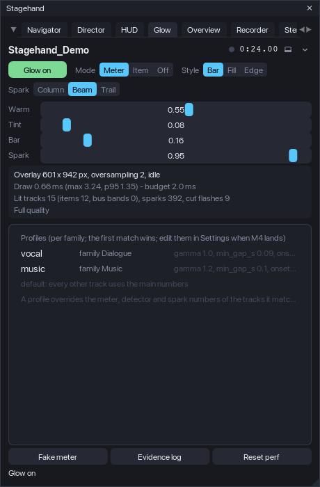{narrow}

### What it draws

For every track shown in the track panel (muted tracks stay dark) the items under the play head get:

- a **fill** whose brightness follows the track's own post-fader meter, normalised to the track's recent peak (an
  adaptive reference that sinks slowly, with a floor so quiet beds still pulse; instant attack, 30 dB/s release,
  gamma 1.6 so quiet moments stay dim);
- a 1 px **outline** a little stronger than the fill;
- in the *Bar* style a **level bar** from the item's bottom, driven by the take peaks of the item's own source
  (400 Hz peaks read directly from the media, unaffected by REAPER's meter ballistics);
- **sparks**: on every onset (the level rose at least 6 dB above a fast-falling detector, at least 60 ms after the
  last one) a bright warm mark at the play head's x, decaying over 0.32 s. In the bar style the onset time comes
  from the take peaks, so a four-hit burst gives four sparks. Three looks (*Spark* in the tab): *Beam* (the
  default: a bright core with a soft halo on both sides, like a glowing play cursor), *Column* (a hard 3 px column
  with a short tail to the right) and *Trail* (a gradient growing from the onset to the play head, brightest at the
  head, with the beam core);
- **colour warming**: the fill blends from the glow colour (white) towards the warm colour (amber) with the level.

The most recently ended item keeps glowing for up to 2.5 s while the track still sounds (reverb tails). Rows without
items (folders, buses, returns) get a **level band** along the bottom of the row. A marker of the *Cut* class the
play head just crossed flashes a full-height line for 0.22 s. Sparks and flashes are blended over the fill by hand,
so they never punch dark holes into the glow.

**Modes**: *Meter* (above), *Item* (the glow follows the item bounds only: a flash at the item start decaying to a
low sustain, a release after the end, long items fainter; no meter needed) and *Off*. **Styles**: *Bar* (faint tint
plus the level bar), *Fill* (a uniform tint that breathes with the meter), *Edge* (only the outline lights up).

**Profiles** tune the numbers per family (the families of the Navigator): the shipped *vocal* profile (Dialogue) is
even (release 40 dB/s, 14 dB window, gamma 1.0, onset 5 dB, gap 90 ms), *music* is rhythmic (release 60, window 12,
gamma 1.2, slower reference, gap 100 ms); every other track uses the main numbers. Profiles are edited in the
Settings tab (Glow > *Profiles*, a JSON editor with validation) and stored under `glow.profiles`.

### The Glow tab

*Glow on* / *Glow off* (G), *Mode*, *Style* and *Spark*, four sliders with live preview (*Warm*, *Tint* or *Fill* depending on
the style, *Bar*, *Spark*; the glow follows while you drag and the setting is written when you let go), the
performance block, the profiles list and three footer buttons: *Fake meter*
(synthetic levels from the item bounds for machines without audio - the test machines; the real meter is still read),
*Evidence log* (one line per lit track per frame into `glow_meter.txt` in the Stagehand folder while playing) and
*Reset perf*.

### Performance guard

The drawing time of every frame is measured (the tab shows the average, the maximum and the 95th percentile). Over
the budget (2 ms) for 30 frames in a row the glow steps down: sparks off, then oversampling 1 instead of 2 (crisp on
Retina, twice the pixels), then the bus band off; after 300 quiet frames it steps back up. On the test machines a frame
costs 0.7-1.3 ms with 53 tracks and 2-6 lit rows; the guard was exercised with an impossible budget and recovered.

### Keys (window focused, Glow tab)

| Key | Action |
|---|---|
| G | glow on / off |
| Space | play / stop |
| Ctrl+D | dock / undock the main window |

## Settings

Every knob of every module lives in one tab: **Settings** (also `Stagehand - Settings`, which opens the app on it).
The tab is drawn from the configuration schema, so a setting can never be missing from it, and the full list with
types, ranges and defaults is in `docs/config-reference.md` (generated from the same schema).

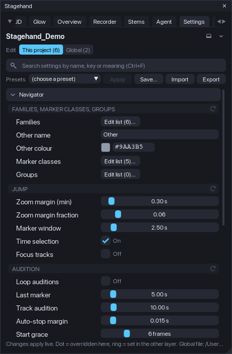{narrow}

### Two layers

Values come from three places, merged in this order: the defaults built into Stagehand, the **global** file
(`<REAPER resource path>/Stagehand/config.json`, every project) and the **project** overrides (stored in the project
file with the rest of the project's state; only the keys you changed for this project). The *Edit* switch at the top
picks which layer the controls write to: *This project* or *Global*. The number next to each is how many overrides
that layer holds.

A **dot** before a setting's name means it is overridden in the layer you are editing; a **ring** means the other
layer sets it (the tooltip says to what). The **x** at the end of a row removes that override; the arrow icon on a
group header resets the whole group in the current layer; the menu has *Reset everything in ...* for the layer.
Nothing is ever reset without you asking, and resetting only removes overrides: the other layer and the defaults
stay.

### Controls

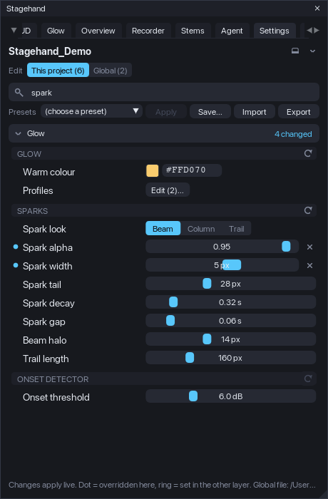{narrow}

Every row has a label, a control and a tooltip with the meaning, the range and unit, the default and the key.
Toggles switch at once. Sliders preview while you drag (the Glow and the HUD follow live) and the file is written
when you let go; Ctrl+click a slider to type a value. Choices are segmented buttons. Colours open a picker and take
a `#RRGGBB` text. Comma lists (caption sizes, ruler lane ids) are typed as text and checked when you leave the field;
a value that does not parse is shown in red under the row and not written. Families, marker classes and groups open
their editors on the Navigator tab; pinned rows and glow profiles open a small JSON editor whose *Apply* is enabled
only while the text is valid.

**Search** (Ctrl+F) filters by name, key or meaning across every module; Esc clears it. Modules fold and unfold by
clicking their header (the state is remembered); a search unfolds everything that matches.

### Presets

The *Presets* row lists the four shipped presets and your own (`<REAPER resource path>/Stagehand/presets/*.json`):

| Preset | What it sets |
|---|---|
| Client showcase | focus layout, page view, bar without key hints, live loudness, beam glow with the cut flash |
| Tutorial | the whole track tree stays, follow view with a longer window, key hints and timecode, a softer fill glow |
| Quick navigation | fuzzy search, focus tracks on a scene jump, a tighter marker window, no bar, no glow |
| Minimal glow | outlines only, faint sparks, no bus band or cut flash, oversampling off |

*Apply* writes the preset's keys into the layer you are editing (other keys stay as they are). *Save...* stores the
current layer's overrides under a name. *Import* reads any preset file (a copy lands in your presets folder);
*Export* writes the current layer to a file, and the menu can export the whole effective configuration. A preset is
a JSON file with a header and a partial config tree (format in the reference); a preset written by an older
Stagehand is migrated when it is read, and one with an invalid value is listed with the problem and cannot be
applied until the file is fixed.

### Problems, not silent repairs

When a layer holds a value Stagehand cannot use (wrong type, outside its range, an unknown choice, a broken
entry in a list) the tab shows a panel at the top: the layer, the key, the value and why. The value is left out of
the effective settings (the default applies) but **the file is not rewritten**: *Use default* removes just that
value when you decide so, *Show* finds the key in the list. Unknown keys are kept and listed for information, so a
file from a newer version loses nothing.

### Updates

The layers carry a schema version. When Stagehand moves or renames a key, the file is migrated on load and the
migration is listed in the panel once; the global file is backed up first (`config.json.schema<N>.bak`). Schema 1
(the M1-M3 builds) to 2: `navigator.layout.compact_below_px` became `ui.compact_below_px` (it applies to every tab).

### Keys (window focused, Settings tab)

| Key | Action |
|---|---|
| Ctrl+F | search field |
| Esc | clear the search |
| Ctrl+D | dock / undock |

### Tips

- Docked low (under 430 px), the Navigator switches to the compact layout: smaller rows, no family row, no hint
  line. Undock or enlarge the docker to reach the chips.
- The lists refresh on every project change; if something looks stale, Ctrl+R.
- Do not save the project while a scene solo, scene mute or focus is active unless you want that state in the file;
  *Restore* first, then save.
- For a recording: dock the HUD at the bottom and make the docker about 90 px tall (medium tier), switch *Key hints*
  off, keep the Glow in Meter / Bar, hide the Stagehand window (or dock it out of the picture) and start with
  *Arm + play* so the recorder can find the flashes.

## Overview

One tall picture of the whole session: the track panel, the ruler and the arrange from the first track to the last,
every used automation lane open, nothing else on screen. Stagehand lays the session out, a companion script (or you,
with any screenshot tool) captures the arrange page by page, and a stitcher pastes the pages at their real scroll
offsets. Everything the layout changes is journaled and put back.

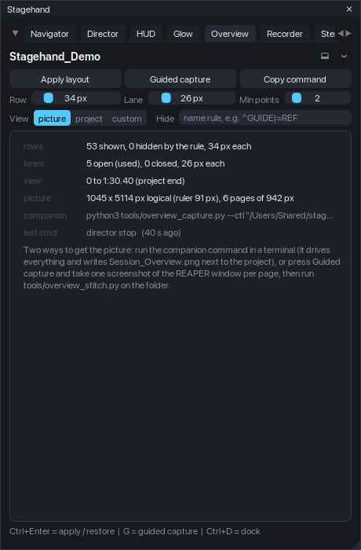{narrow}

### The layout

*Apply layout* (Ctrl+Enter) does, in one frame: the mixer closed, the master row taken out of the track panel, the
video window closed (each a setting), every track shown at one locked height (`overview.track_px`, 34 px) with the
folders opened and the pins off, tracks matching the *Hide* rule left out (`^GUIDE|=REF`: starts with, equals,
contains; `|` separates), every **used** envelope lane open at one height (`overview.env_lane_px`, 26 px; used = at
least *Min points* points or an automation item), the other lanes closed, the view from 0 to the end (the last video
item, the project length, or a custom time, plus a pad), scrolled to the top. The summary under the buttons says
what happened: rows shown and hidden, lanes open and closed, the view end and why, the picture size in logical
pixels, how many pages the capture needs. *Restore* (the same button) puts everything back; so does closing
Stagehand, a frame error or REAPER's exit.

### Capturing with the companion

Save the project first (the companions talk through `<project folder>/Render/stagehand_ctl/`), keep Stagehand
running, then in a terminal:

```
python3 tools/overview_capture.py --ctl "<the folder shown in the tab>"
```

*Copy command* puts the exact line on the clipboard. The driver asks Stagehand to apply the layout (Stagehand's own
window hides so it never covers the arrange), reads the screen crop, scrolls one page at a time (Stagehand answers
each scroll after the redraw), captures the crop with the first tool that works on your system (macOS
`screencapture`, Pillow, Linux `scrot` or ImageMagick, Windows PowerShell), asks for the restore and stitches the
pages into `Render/overview_<date>/Session_Overview.png` plus a half-size copy. Retina and HiDPI screens come out in
native pixels (the stitcher measures the scale from the PNG width); `overview.output.dpi_mode = logical` scales the
result down. On macOS the capture path is experimental in this release: it works on the developer's machine, and
it was verified on Linux and Windows.

### Guided capture (any screenshot tool)

*Guided capture* (G) is the fallback when no companion runs: Stagehand applies the layout, hides its window, writes
`pages.txt` and `geometry.txt` into the output folder and shows a small counter window (*Page 1 of 6*). Capture the
REAPER window with whatever you like (Shift+Cmd+4 then Space on macOS, Win+Shift+S, a screenshot app), press *Next*
(Space, N or the right arrow), repeat; *Done* on the last page restores the session. `overview.guided.auto_s` makes
the pages advance by themselves for a screen recorder. Then put the screenshots into the folder as `page_00.png`,
`page_01.png`, ... and run:

```
python3 tools/overview_stitch.py "<Render/overview_<date>>"
```

The stitcher recognises whole-window screenshots by their width and crops them itself (`--window` forces it).

### Keys (window focused, Overview tab)

| Key | Action |
|---|---|
| Ctrl+Enter | apply / restore the layout |
| G | guided capture |
| Space, N, right arrow / P, left arrow / Esc | next / previous page / stop (counter window focused) |
| Ctrl+D | dock / undock |

## Recorder

The Recorder tab is where a recording session is prepared and driven: the **control protocol** for the companion
scripts, a **checklist** of what should be true before the take, the **screen layout at start** (monitor, main
window, video window, a named window into a docker), **Arm / Play / Stop** by hand, and the **shot-list export**.
It never requires the other modules: the Director run, the HUD bar and the Glow are driven through commands and
events, so each works without the others.

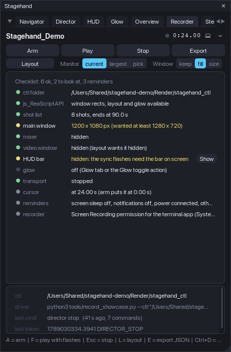{narrow}

### Arm, play, stop

*Arm* (A) puts the edit cursor at `recorder.arm.cursor_s` (0), starts the Director run when there are shots (the
first shot is laid out before the flash), shows the HUD bar, applies the screen layout when `recorder.layout.apply`
is on, and writes the `hud` file (the bar's painted rect, the full monitor and the work area in logical pixels): the
recorder post needs it to find the flashes. *Play* (F) is the HUD's sync sequence (white frames, dark gap, play,
white frames at the end, stop); *Stop* (Esc) cancels it. The badge in the header shows ARMED and FLASH.

### The checklist

Live rows, refreshed twice a second: the ctl folder (a saved project), js_ReaScriptAPI, the shot list and its
validation, the main window size against `recorder.checklist.min_w/min_h`, the mixer hidden, the video window as the
layout wants it, the HUD bar on screen (size, tier, docked), the loudness curve when the HUD uses one, the Glow, the
transport stopped, the cursor at the arm position, and two reminders (screen sleep and notifications; the recorder
permission or ffmpeg). Rows with a *Fix* button apply it through the journal (hide the mixer, show the bar, stop),
so *Restore* puts them back.

### Screen layout at start

*Layout* (L) lays the screen out for the take and *Unlayout* puts it back (js_ReaScriptAPI needed): the monitor
(the one holding the main window, the largest, or a number), the main window (kept, filling the monitor work area,
or a custom size centred), the video window (shown and placed in a corner, over the track panel, over the arrange
top-right, or *fit*: 16:9 sized to the space above the tracks; REAPER re-applies its own saved rect when the window
first shows, so Stagehand places it a few frames later and reads it back 1.5 s after), and a named script window
sent to a docker (`recorder.layout.dock_window`: the window's dock ident, the action that opens it, the docker
position; a script cannot create a docker - when no docker has that position the diary says so). Every step is
written to the **layout diary** (`layout.txt` in the ctl folder and the log): what was wanted and what REAPER did;
it is the only way to debug a layout on another machine. Window rects, docker ids and toggles are journaled and
restored.

### The control protocol

`<project folder>/Render/stagehand_ctl/` (or `recorder.ctl.dir`): a driver writes one line into `cmd`, Stagehand
reads and deletes it every `recorder.ctl.poll_frames` frames and appends replies to `state` as
`<time_precise> TOKEN key=value ...`. Verbs: `ping` (PONG), `arm` (ARMED with the shot count, the end time, whether
the run and the bar are up), `play`, `stop` (STOPPED), `quit` (stop, Director run and layout restored, QUIT),
`rect` (every rect the layout relies on), `hud` (write the hud file), `layout` / `unlayout`, `vid x y w h` (place
the video window), `glow on|off`, `shots [csv]` (export), `goto <s>`, and the Overview's `overview apply | rect |
scroll <px> | pages | restore`. While a run is armed the HUD's flash tokens (`PLAY_REQUEST`, `FLASH_START`,
`PLAY_CMD`, `PLAY_POS`, `PLAY_MOVING`, `FLASH_END`, `END`, with the play position) and `SHOT k=.. name=..`,
`DIRECTOR_START` / `DIRECTOR_STOP` are mirrored into `state`. The protocol panel of the tab shows the folder, the
companion command for the project, the last command and the last token.

### Recording with the companion

```
python3 tools/record_showcase.py --ctl "<the ctl folder>" --mix "<the delivered mix.wav>"
```

The driver pings Stagehand, writes the loudness curve of the mix for the HUD (ffmpeg), arms, starts the screen
capture (macOS `screencapture -v` with the display found by its size, or `ffmpeg` x11grab / gdigrab, or a Pillow
frame loop for a sync check without ffmpeg), waits 2.5 s, plays, waits for `END`, stops the capture, sends `quit`
and runs the post: `showcase_post.py` finds the two flashes in the recording (the brightness of the bar's crop per
frame), anchors mix time 0 on the **end flash** (start and moving anchors are reported too; the difference is the
engine start latency, 40-90 ms on the test machines), lays the mix under the picture, writes a native and a 1920 px
wide MP4 and `report.json` / `report.md`. `--dry 5` records five seconds without playback to check the permission
and the display. `tools/README.md` documents the sync method and every option. On macOS the driver is experimental in
this release (verified by the developer, not on the test machines).

### OBS recipe (no scripts)

1. Scene with one **Display Capture** source of the monitor Stagehand lays out (not a window capture: the video
   window and the HUD bar are separate windows). Output 60 fps, canvas = the monitor, no audio track.
2. Encoder: x264 CRF 16-18 (or NVENC / VideoToolbox CQP 16), MKV container (remux later); keep the recording folder
   on a fast disk.
3. Stagehand: *Arm*, wait for the bar, start the OBS recording, then *Play* (or let `record_showcase.py --backend
   frames` drive only the protocol). Stop OBS after the end flash.
4. Post: `python3 tools/showcase_post.py "<take.mkv>" --state "<ctl>/state" --hud "<ctl>/hud" --mix "<mix.wav>"
   --out "<folder>"` - the same anchors and outputs as with the driver.

### Shot-list export and import

*Export* (E for JSON) writes the Director's shot list next to the project (`Render/<project>_shots.json` or `.csv`,
or a file you pick when js_ReaScriptAPI is installed): JSON carries the whole shot model plus timecodes for tools;
CSV has one row per shot (index, name, start, end, duration in seconds, timecode or m:ss by
`recorder.export.time_format`, timecode columns, both captions, lane and envelope rules, view, parents) for
spreadsheets and editors' notes. *Import (replace / append)* reads a JSON export back into the shot list.

### Keys (window focused, Recorder tab)

| Key | Action |
|---|---|
| A | arm |
| F | play with sync flashes |
| Esc | stop |
| L | layout / unlayout |
| E | export the shot list (JSON) |
| Space | play / stop |
| Ctrl+D | dock / undock |

## Stems

The Stems tab runs a **stem delivery**: a list of named solo / mute states of the track list, each rendered through
the master one at a time with render settings Stagehand owns, into files named by a pattern, with a **pre-flight**
that refuses everything REAPER would stop and ask about, and a **results page** after the batch (peak, loudness,
length, silent stems). It never requires the other modules; the families come from the same rules the Navigator uses.

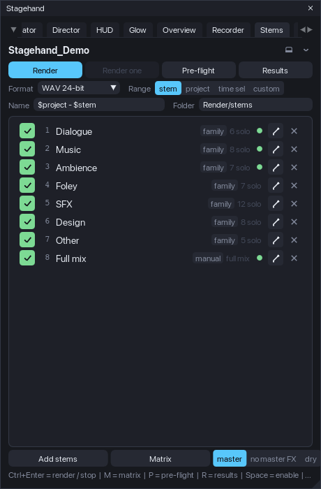{narrow}

### A stem

A stem is a name plus one cell per track: **S** (solo in place, sends and returns follow), **I** (solo ignore
routing) or **M** (mute); tracks without a cell are not soloed. A stem without any cell is the **full mix**. When the
batch applies a stem it writes the solo state of *every* track (a temporary solo of yours is cleared for the render
and put back after) and mutes only the tracks with an M cell (a track you muted stays muted). A stem may carry its own
**range** (a scene stem renders its region) and a **variant**: *through master* (as the mix), *master FX bypassed*, or
*dry* (every send muted); the toggles are journaled and restored after each stem.

### Building the set

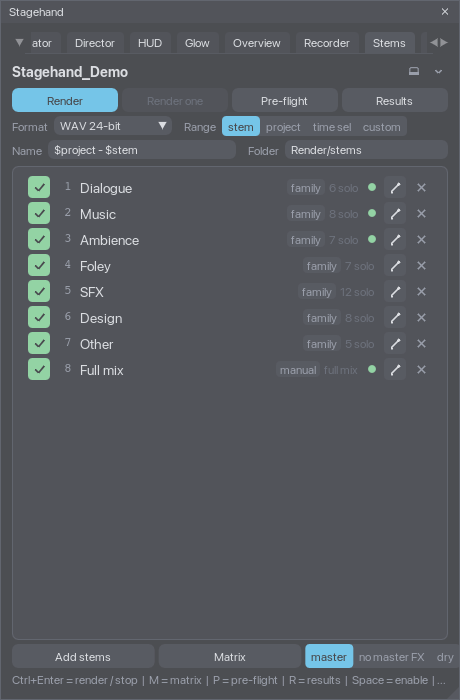{mid}

*Add stems* offers the bulk builders: **one stem per family** (the Navigator's families; a folder belongs to the family
of its top ancestor), **one stem per top folder** (the folder track soloed in place plays its children; `stems.bulk.
folder_children` marks the children too), **one stem from the selected tracks**, **one mix per scene** (full mix,
the region as the range), **capture the current solo / mute state**, and an empty full-mix stem. Names are made
unique ("Music 2") because the file names come from them. The **matrix** (M, or the pencil of a row) edits the cells:
tracks in rows with their family dot and folder indent (the column is as wide as the longest name, up to 60 % of
the editor, and its border can be dragged), stems in numbered columns, a click cycles off -> S -> I -> M,
right-click clears, a filter narrows the rows; Save writes the cells, Cancel drops them. Double-click a row to rename,
Space toggles *enabled* (a disabled stem stays in the list and out of the batch), the row menu sets the variant and
the range (none, the time selection, a scene), moves, duplicates and removes.

The set lives in the project (saved with it). With `stems.membership.write_tracks` on (default) every track also
carries its cells in its extension state, so a **track template** made from it remembers its stems: *Adopt
membership from tracks* (also run when a project opens) puts a track inserted from such a template back into the
stems of the same names. **Presets** (*Stem set presets* in the Add menu) save the whole set as a file in
`<resource>/Stagehand/stems/` and load it into another project: tracks are re-found by GUID first, then by name;
the message says how many were found.

### Render settings

The quick row: **format** (WAV 16 / 24-bit / 32-bit float, FLAC or MP3 with REAPER defaults, or the project's own
render format), **range** (*stem* = a stem's own range when it has one, else the fallback in Settings: project by
default; *project*; *time sel*; *custom* start .. end), **existing files** (*replace*: the file is deleted before the
render; *number*: `name_2`, `name_3`...; *skip*: the stem is skipped - REAPER's own overwrite prompt would block an
unattended batch, so Stagehand decides before the render), the file **name** pattern and the **folder** (relative to
the project, `Render/stems` by default, or absolute). The pattern knows `$stem`, `$stemnumber` (01, 02...), `$scene`
and `$variant`; `$project`, `$date`, `$time` and REAPER's other wildcards are left to REAPER. With more than one stem
the pattern must contain `$stem`, `$stemnumber` or `$scene`. Sample rate, channels, tail, normalisation (LUFS-I / -M
max / -S max / peak / true peak to a target) and dither live in Settings > Stems. The batch writes these settings into
the project through the journal and puts the project's own render settings back when it ends; the render source is
always the master mix (never REAPER's stems mode or the region matrix, which are unreliable from scripts).

### Pre-flight and the batch

*Pre-flight* (P) lists what a batch would meet: the folder as REAPER resolves it (an unsaved project with a relative
folder is an error), the enabled stems, the pattern, stems whose tracks are gone or partly missing, an empty range
(REAPER would show "Nothing to render"), two stems writing the same file, files that exist and what the policy does
with them, the transport (recording is an error; playing is stopped with *Fix*), whether REAPER's render statistics
are on, and notes about the format and the variants. *Render* (Ctrl+Enter) runs the pre-flight and refuses to start
on an error. The batch then goes stem by stem in the window's own loop: apply the cells and the variant (journaled),
write the settings, defuse the file by policy, render with REAPER's "render using the most recent settings" action
(synchronous: the script resumes when the file is written), measure the file, put the state back, wait a few frames,
next. The strip shows the stem, the phase and a progress bar; *Stop* (Esc) ends the batch after the current stem.
*Render one* renders the highlighted stem. A frame error, the Restore menu entry, closing the window and REAPER's exit
drop the batch and restore everything it changed.

### Results

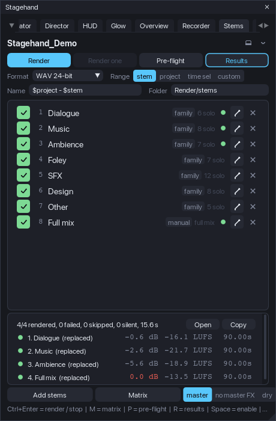{narrow}

*Results* (R) shows the last batch: per stem the status dot (ok, silent, error, skipped), the file, the sample peak in
dBFS (scanned by Stagehand for WAV files, exact), the integrated loudness and the length; *Open* opens the folder
(SWS) or copies its path, *Copy* puts the table on the clipboard as Markdown. `stems_results.json` is always written
next to the stems, `.csv` and `.md` by `stems.export.results`. Loudness (LUFS-I, LUFS-M max, LUFS-S max, LRA) and
REAPER's own peak come from **REAPER's render statistics**, which need the preference *Preferences > Rendering >
Stats/Charts > save render statistics*: with SWS installed Stagehand switches it on for the batch and back after
(`stems.results.reaper_stats`); without it the pre-flight says how to enable it and the results carry Stagehand's peak
and length only. A stem whose peak is at or below `stems.results.silent_below_db` (-90 dBFS) is flagged **silent**
(a solo state that plays nothing in the range). `tools/stems_check.py --results <folder>/stems_results.json`
measures every WAV independently (peak, length, LUFS-I with numpy; ffmpeg ebur128 too when present) and reports the
differences.

### Restore: nothing is left behind

Solo and mute values, the master FX enable, send mutes and every RENDER_* value the batch wrote are journal entries
(owner `stems`) restored after each stem or the batch, on Stop, on an error and at exit; a solo you set yourself before
the batch comes back as it was (kept semantics). The stems folder and its files are the only thing that stays.

### Keys (window focused, Stems tab)

| Key | Action |
|---|---|
| Ctrl+Enter | render the enabled stems / stop |
| Esc | stop after the current stem |
| M | matrix editor |
| P | pre-flight |
| R | results panel |
| Space | enable / disable the highlighted stem |
| Up / Down | highlight |
| Delete | remove the highlighted stem |
| Ctrl+D | dock / undock |

## Agent access

An AI agent (Claude, ChatGPT, anything that speaks MCP) can read the open session and drive Stagehand from a
conversation: "what is in this session", "go to the fight scene", "solo scene 4", "start the showcase", "set the
lead time to half a second", "render the stems and tell me how loud the music was". Nothing an agent does saves the
project; every change it makes goes through the same journaled paths as your clicks and is restored like them.

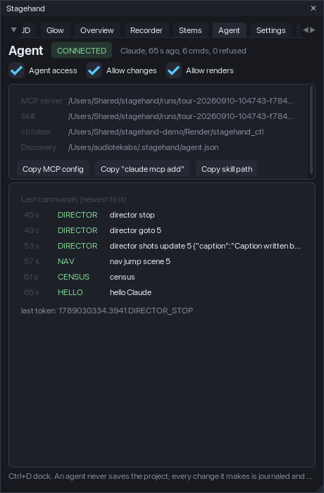{narrow}

### How it works

The Recorder's control protocol (the `cmd` / `state` files in `<project>/Render/stagehand_ctl`) grew agent verbs
that answer with JSON files (`reply_N.json`, named in the token line): `hello <name>`, `verbs`, `state`, `census`,
`shotlist`, `stemset`, `results`, `config get <key> | list [prefix] | set <key> <value> [project|global] | reset
<key> [scope]`, `nav jump scene|marker|time ... | solo <scene> | mute <scene> | clear | restore`, `director
start | stop | goto <k> | next | prev | auto on|off | validate | shots set <json> | add <json> | update <k> <json> | remove
<k> | clear | from_scenes` (the shot list itself, so an agent can write the whole showcase from a description), `command <name>` (the app commands: `glow_off`,
`hud_show`, `overview_apply`, ...). The package ships an MCP server (`agent/stagehand_mcp.py`, Python 3, standard
library only, stdio) that exposes them as typed tools, and a skill (`agent/skills/stagehand/SKILL.md`) that teaches an
agent the workflow: read first, ask before changing anything, never save, confirm a render with you in the
conversation.

While Stagehand runs it refreshes a discovery file, `<home>/.stagehand/agent.json`, with the ctl folder of the open
project, so the server needs no arguments and follows the project you switch to. An unsaved project has no ctl folder
(the tab says so); `agent.discovery = off` stops the file, then the server takes `--ctl <folder>` or `--project
<file.RPP>`.

### Install the server in your agent

The Agent tab shows the installed paths and copies the two forms most agents take:

- Claude Code: `claude mcp add stagehand -- python3 "<path>/Stagehand/agent/stagehand_mcp.py"` (Copy "claude mcp add").
- Claude Desktop, Cursor and others: the `mcpServers` snippet (Copy MCP config) pasted into the agent's MCP
  configuration file.

Copy the skill folder into your agent's skills (`.claude/skills/` of a project or `~/.claude/skills/`) with the path
the tab copies. Then ask the agent about the session; the first tool call says hello and the tab shows the agent's
name, when it connected, how many commands it sent and how many were refused, and the last commands with their tokens.

### The three switches

- **Agent access** (`agent.enable`): the agent verbs answer. Off: every agent verb is refused (`ERROR ... refused:
  agent access is off`); the companions' own verbs (`ping`, `arm`, `play`, `rect`, ...) keep working.
- **Allow changes** (`agent.allow_changes`): anything that changes the project or the screen, from any driver:
  jumps, scene solo / mute, Director runs, commands, `config set` / `reset`, `arm`, `play`, `layout`, `vid`, `glow`,
  `goto`, `overview apply`, `stems render`. Off: reads only. `stop`, `quit`, `unlayout`, `overview restore` and `nav
  restore` always work - a driver must always be able to put things back.
- **Allow renders** (`agent.allow_render`): `stems render` may start a batch (needs Allow changes too). The MCP tool
  refuses on its own until the agent passes `confirm=true`, which the skill tells it to do only after your clear yes.

The switches are global settings (they follow you, not the project). A refusal names the switch in the ERROR line
and the agent is told to stop, not to work around it.

### The tools an agent sees

`stagehand_status` (read this first: project, transport, every module's state, the journal counts, the switches),
`stagehand_census` (tracks with families, scenes, markers, families, groups), `stagehand_shots` (the shot list with
the validator's issues), `stagehand_stems` (the stem set and the render settings), `stagehand_results` (the last
batch, per stem), `stagehand_config` (get / list / set / reset with the schema's ranges enforced), `stagehand_jump`
(scene by name, part or number; marker; time), `stagehand_scene` (solo / mute / clear / restore),
`stagehand_director` (start / stop / goto / next / prev / auto / validate), `stagehand_command`,
`stagehand_stems_render` (`confirm=true` required; `stop=true` cancels), `stagehand_verbs`, `stagehand_raw` (any
protocol line and the token to wait for) and `stagehand_connect` (a specific ctl folder or project instead of the
discovered one).

### Keys (window focused, Agent tab)

| Key | Action |
|---|---|
| Ctrl+D | dock / undock |

## Support the development

Stagehand is free and open source. If it earns its place in your sessions, consider supporting its development:
[Ko-fi](https://ko-fi.com/quickmd), [Buy Me a Coffee](https://buymeacoffee.com/bsroczynskh) or
[PayPal](https://paypal.me/b451c). The About tab has the same three buttons: with SWS installed they open your
browser, without it the link is copied to the clipboard. Bug reports and ideas: GitHub Issues of the repository named
in the README.


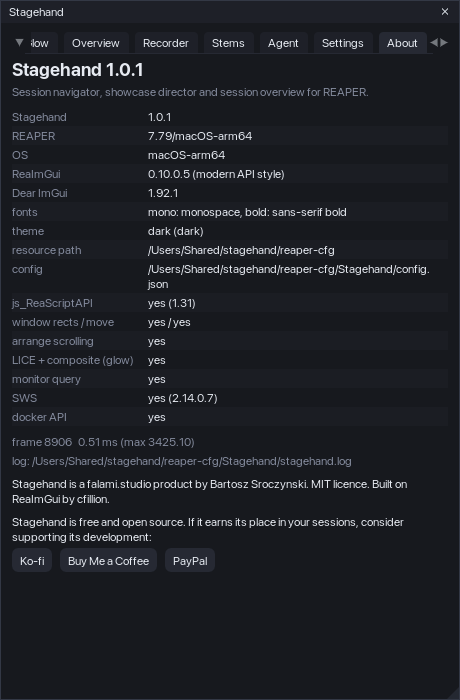{narrow}